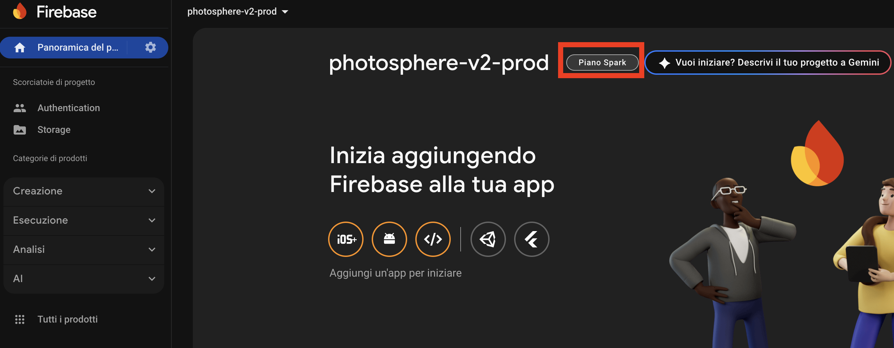
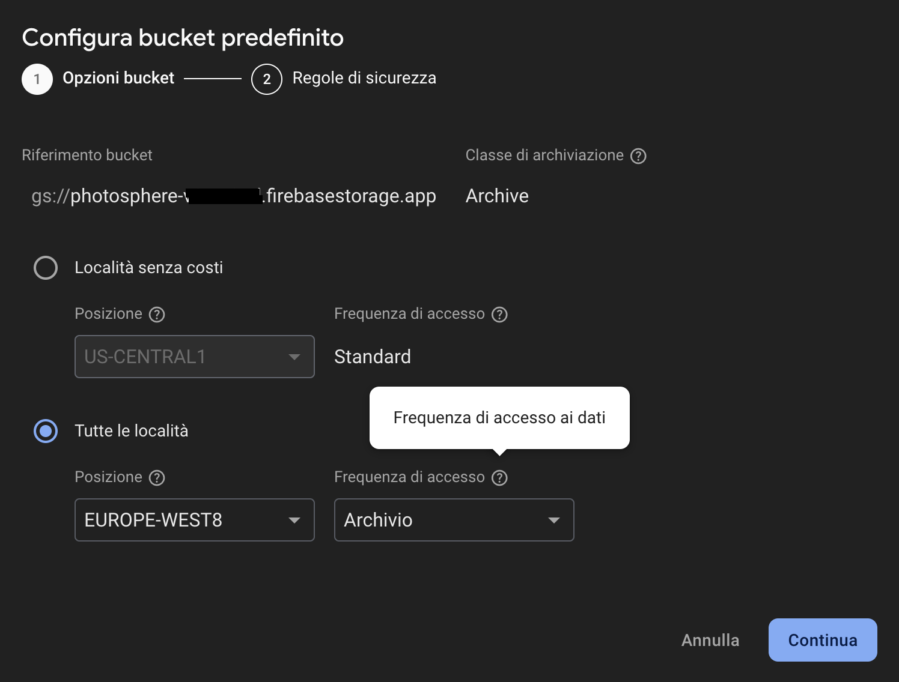

# Photosphere v2

Photosphere v2 is a web application that allows users to upload photos, videos, and files, and view them anywhere. 
The application is built using modern web technologies and is designed to be user-friendly, responsive, secure, and cost-effective!


**Extremely affordable, 6 to 20 times cheaper than Google Photos!**

## Project Deployment
We use a fully serverless solution to deploy the entire project, based on Firebase services.
1. Make sure you have the Firebase CLI installed. If you haven't installed it yet, check the official documentation [here](https://firebase.google.com/docs/cli#install_the_firebase_cli).
2. Make sure you have the GCloud CLI installed. If you haven't installed it yet, check the official documentation [here](https://cloud.google.com/sdk/docs/install).
3. Log in to your Firebase account using the command:
```sh
firebase login
```
Or, if you are already logged in:
```
firebase login --reauth
```

4. Log in to your GCloud account using the command:
```sh
gcloud auth login
gcloud auth application-default login
```

5. Create the Firebase project using the command below. 
The project ID must be 6-30 characters. 
We suggest using the name **photosphere-v2-** followed by a 5-character random string (e.g., photosphere-v2-x1y2z):
```sh
firebase projects:create --display-name photosphere-v2
```

6. Select the project using the commands:
```sh
firebase use <project-id>
gcloud config set project <project-id>
```

7. Add Firebase app data to the project using the command:
```bash
./firebase_sdk_setup.sh
```

8. Select a payment plan for the project using the Firebase Console:
    * Go to the [Firebase Console](https://console.firebase.google.com/).
    * Select your project.
    * Go to the settings (gear icon) next to "Project Overview" in the left sidebar.
    * Select the Spark plan (free plan) and confirm the link with the service account.


9. Create storage in your Firebase project using the Firebase Console:
    * Go to the [Firebase Console](https://console.firebase.google.com/).
    * Select your project.
    * Select "Storage" from the left-hand menu.
    * Click on "Get Started" and select all the options.

   We suggest:
    * Selecting the location closest to you.
    * Choosing a single region for lower costs (e.g., EUROPE-WEST8).
    * Setting Archive as the default storage class to save costs.
Then click on "Production mode".

10. In the file `storage.rules`, change the email to your own to enable login, upload, and download permissions.

11. Set the CORS configuration for the storage bucket using the command:
```sh
gcloud storage buckets update gs://<project-id>.firebasestorage.app --cors-file=cors.json
```

12. Deploy the project using the command:
```sh
./deploy.sh
```